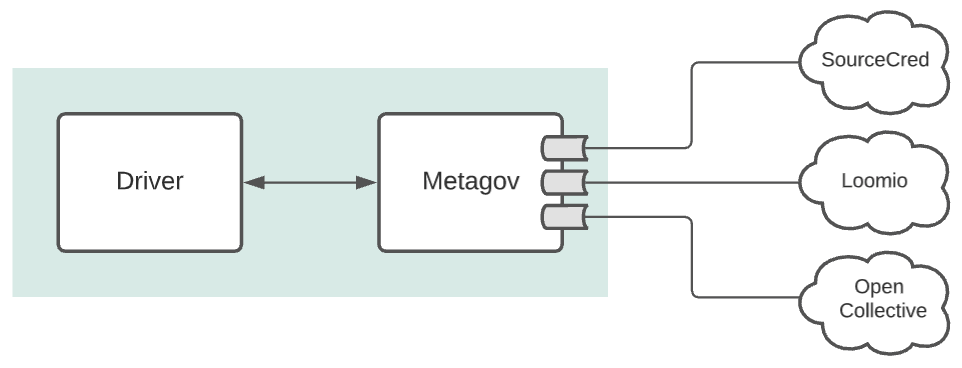
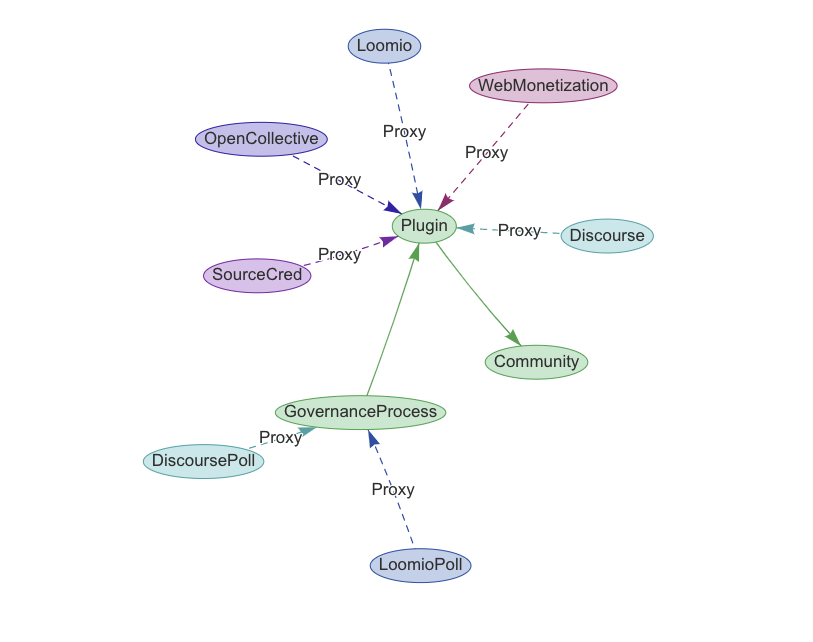

Design Overview
===============

Metagov is a Django backend service with a plugin architecture. Metagov is meant to be deployed alongside a governance :ref:`Driver`, which
uses the `Metagov API <https://prototype.metagov.org/redoc/>`_ to communicate with zero or more third party services.

Metagov has a plugin architecture, with nearly all the functionality being defined in the plugins. Plugins are typically used to integrate with
an external platform such as SourceCred or Loomio, and expose their governance-related functionality through a common API interface that can be consumed
by the Driver.

API Access
--------------------------

Some Metagov endpoints are public, and others are restricted to **local traffic** ("INTERNAL"). Internal endpoints can only be accessed by the :ref:`Driver`.
For now, the public endpoints are completely public (there is no auth).

+----------------------------------------------+----------+--------------------------------------------+
|                 Metagov URL                  |  Access  |                Description                 |
+==============================================+==========+============================================+
| ``/api/hooks/<community>/<plugin>``          | PUBLIC   | Receive incoming events from external      |
|                                              |          | platforms (Open Collective, Loomio, etc)   |
+----------------------------------------------+----------+--------------------------------------------+
| ``/api/internal/community/<community>``      | INTERNAL | Create/update/delete a community           |
+----------------------------------------------+----------+--------------------------------------------+
| ``/api/action/<plugin>.<action>``            | PUBLIC   | Perform an action that is configured       |
|                                              |          | to be public by the plugin author          |
+----------------------------------------------+----------+--------------------------------------------+
| ``/api/internal/action/<plugin>.<action>``   | INTERNAL | Perform an action                          |
+----------------------------------------------+----------+--------------------------------------------+
| ``/api/internal/process/<plugin>.<process>`` | INTERNAL | Perform an asynchronous governance process |
+----------------------------------------------+----------+--------------------------------------------+

Driver
------

The Driver implements a governance engine of some kind. It may allow people to author governance policies, and implement the ability to
incorporate the processes, listeners, and resources defined by Metagov plugins into governance policies. It’s up to the driver whether they can do this abstractly (so they can handle any Metagov plugin) or
whether they need to painstakingly do this one by one and so only work with some plugins.

The Driver might be capable of supporting multiple communities or only one community. The Driver is responsible for configuring the community(ies)
in Metagov by making a request to Metagov's ``/community`` endpoint. After that, any time the Driver makes a community-specific request to Metagov,
it must include the unique community name in the header ``X-Metagov-Community``.

The Driver may also react to event notifications that it receives from Metagov, which could in turn trigger a policy evaluation.

For a minimal example of a driver, see the repo `metagov/example-driver <https://github.com/metagov/example-driver>`_.

Communities
-----------

A Community represents a group of people that use one or more online platforms together. A community can activate and configure metagov plugins to use them for governance.

The :ref:`Driver` can create or update a community by making a ``PUT`` request to the ``/community`` endpoint. Here's an example of a JSON-serialized community that has the ``sourcecred`` plugin enabled:

.. code-block:: json

   {
      "name": "metagov-project-community",
      "readable_name": "The Metagovernance Project",
      "plugins": [
         {
            "name": "sourcecred",
            "config": {
               "server_url": "https://metagov.github.io/sourcecred-instance"
            }
         }
      ]
   }

Metagov Core
------------

The Metagov core is responsible for:

* Managing plugins and exposing their functionality to the Driver in the form of a REST API.
* Sending event notifications from Plugins to the Driver
* Exposing endpoints for receiving webhook events from external platforms, and routing hooks to the correct plugin.

Metagov Plugins
---------------

Developers can create Plugins to connect to governance services and platforms.
Plugins are defined as proxy subclasses of the Plugin model.
Plugin authors define governance processes and actions on the model, and Metagov Core exposes them to the Driver via the Metagov API.
See :doc:`Plugin Tutorial <../plugin_tutorial>`.

Django Data Model
-----------------

Metagov Core defines three Django models: ``Community``, ``Plugin``, and ``GovernanceProcess``.

The ``GovernanceProcess -> Plugin`` relationship is many-to-one. A single Loomio model can have multiple LoomioPoll processes going at once.

The ``Plugin -> Community`` relationship is many-to-one. A single Community can have several of Plugins activated. Currently it can only have one instance `per proxy type` (one community can't have two instances of Loomio, for example).

See the :doc:`Reference Documentation <../autodocs/core>` for reference.

